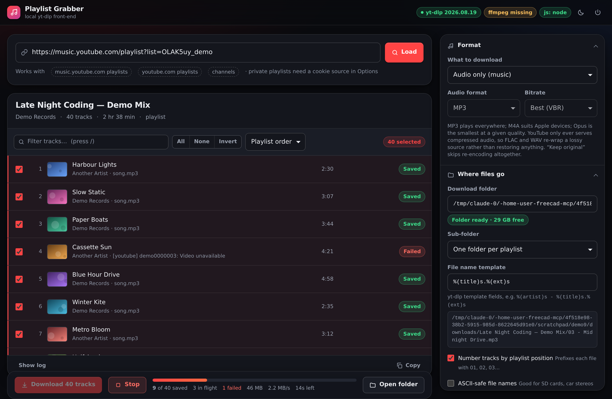
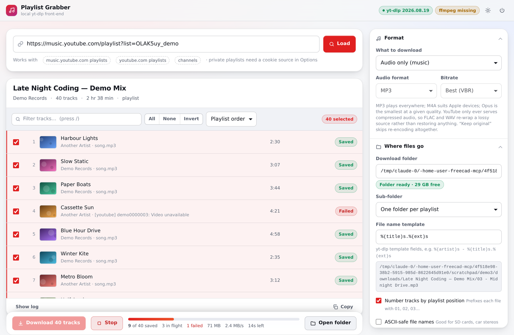

# Playlist Grabber

A local HTML app for pulling YouTube / YouTube Music playlists down as tagged audio files.
Paste a playlist link, see every track, tick the ones you want, watch them download.

It is a thin, well-behaved front-end over [**yt-dlp**](https://github.com/yt-dlp/yt-dlp) —
the open-source project that does the actual work. Nothing leaves your machine except the
requests yt-dlp makes to YouTube.



<details>
<summary>Light theme</summary>



</details>

```
ytmusic-downloader/
├── index.html      the app — all UI, one self-contained file
├── ytmd.py         the local service that drives yt-dlp (stdlib only)
├── requirements.txt
├── start.sh / start.cmd
├── docs/           screenshots
└── tests/          62 offline tests
```

---

## Before you use it

Downloading copyrighted music you do not hold rights to is against
[YouTube's Terms of Service](https://www.youtube.com/t/terms), regardless of which tool does it.
This app is built for the cases where downloading is legitimate:

* **your own uploads**
* **Creative Commons–licensed videos** (YouTube's search has a *Creative Commons* filter)
* **public-domain recordings**
* the **[YouTube Audio Library](https://www.youtube.com/audiolibrary)**
* anything you are separately licensed for

If what you actually want is your music available offline, **YouTube Premium** and
**YouTube Music** offer sanctioned offline playback, and that is the path that does not
depend on an extractor that YouTube keeps changing.

The app shows this notice on first run. Dismissing it does not change what is legal.

---

## Requirements

| | |
|---|---|
| **Python** | 3.9 or newer |
| **yt-dlp** | installed via `requirements.txt` |
| **A JavaScript runtime** | **required for YouTube** — Deno, Node, Bun or QuickJS. See below. |
| **ffmpeg** | *optional but strongly recommended* — without it there is no MP3 conversion, no tags and no cover art |

### The JavaScript runtime

Current yt-dlp cannot read YouTube without a JS runtime, because it has to execute
YouTube's player code to work out stream URLs. It only looks for **Deno** on its own — so a
machine with Node installed and no Deno looks broken until the runtime is named explicitly.

This app detects what you have, shows it in the header, and tells yt-dlp to use it. If none
is found the header says so in red, because nothing will work until you install one:

```bash
# Deno - what yt-dlp prefers
curl -fsSL https://deno.land/install.sh | sh      # macOS / Linux
winget install DenoLand.Deno                      # Windows
# ...or Node, which you may already have
brew install node / sudo apt install nodejs / winget install OpenJS.NodeJS
```

Pick a specific one under **Options → Network & access → JavaScript runtime** if
auto-detection chooses wrong.

### ffmpeg

Installing it:

```bash
# macOS
brew install ffmpeg
# Debian / Ubuntu
sudo apt install ffmpeg
# Fedora
sudo dnf install ffmpeg
# Arch
sudo pacman -S ffmpeg
# Windows
winget install Gyan.FFmpeg     # or: choco install ffmpeg
```

The app detects ffmpeg automatically and tells you in the header whether it found it.
If it lives somewhere unusual, set the path under **Options → Network & access → ffmpeg location**.

---

## Install and run

```bash
cd ytmusic-downloader

python3 -m venv .venv
source .venv/bin/activate          # Windows: .venv\Scripts\activate
pip install -r requirements.txt

python3 ytmd.py
```

Your browser opens on `http://127.0.0.1:8765/`. That's the whole app.

Or use the launcher, which sets the virtualenv up for you the first time:

```bash
./start.sh          # macOS / Linux
start.cmd           # Windows
```

Useful flags:

```
python3 ytmd.py --port 8899        # different port (0 picks a free one)
python3 ytmd.py --no-browser       # don't open a browser
python3 ytmd.py --output ~/Music   # override the download folder for this run
```

Keeping yt-dlp current matters more than anything else here — YouTube changes its player
regularly and a stale yt-dlp is the single most common cause of failures:

```bash
pip install --upgrade yt-dlp
```

---

## What it does

**Loading**

* YouTube and YouTube Music playlists, albums, mixes, channels, and single videos
* bare IDs (`PLxxxx`, `dQw4w9WgXcQ`) and free text, which becomes a YouTube search
* channel URLs are flattened into a single track list
* private / *Liked music* playlists work once you point it at a cookie source

**Picking**

* every track listed with thumbnail, artist and length before anything downloads
* filter, sort, select all / none / invert, shift-click for ranges, full keyboard navigation
* unavailable and deleted entries are greyed out and excluded automatically
* the list is virtualised, so a 5 000-track channel scrolls smoothly

**Downloading**

* MP3, M4A, Opus, FLAC, WAV, or the original stream untouched
* video mode too, up to 2160p, with MP4 / MKV / WebM containers
* configurable parallel downloads, speed cap, retries, and a polite inter-track pause
* live per-track progress, speed and stage; per-job aggregate progress and ETA
* stop the whole job mid-flight, then retry just the failures
* the yt-dlp log is right there in a drawer when something goes wrong

**Filing**

* per-playlist, per-artist, custom, or flat folder layouts
* yt-dlp output templates for filenames, with a live preview
* optional `01 - ` track numbering and ASCII-safe filenames
* title / artist / album tags and embedded cover art (needs ffmpeg)
* SponsorBlock trimming of `music_offtopic` segments — intros, outros, talking
* a download archive so re-running a playlist only fetches what is new
* optional `.m3u8` playlist file

---

## Options worth knowing about

**Cookies.** Private playlists, *Liked music*, age-restricted tracks and — increasingly —
plain public videos need you signed in. Pick your browser under **Cookies**, and *close that
browser first*: it holds a lock on its own cookie database. Alternatively export a
`cookies.txt` and point the app at it.

**Pause between tracks.** On by default. It makes a large playlist noticeably slower and
makes YouTube's *"Sign in to confirm you're not a bot"* check far less likely. Leave it on.

**Remember what was downloaded.** Writes `.ytmd-archive.txt` in the download folder. Re-run
the same playlist later and only new tracks are fetched. Delete that file to start over.

**FLAC and WAV.** YouTube only ever serves lossy audio. Converting to FLAC produces a
lossless copy *of a lossy source* — bigger files, not better sound. Opus or M4A keep the
original codec family; "Keep original" skips re-encoding entirely.

---

## How it is kept local

The service drives yt-dlp with whatever options the page sends, so it is deliberately
locked to your own machine:

* the socket binds to `127.0.0.1` only, and `--host` refuses anything that is not loopback
* the `Host` header must name a loopback address, which is what defeats DNS-rebinding attacks
* the `Origin` header, when present, must match this exact service
* every `/api/` call carries a per-process random token, injected into the page the service
  itself serves — a page on another origin cannot read it
* no `Access-Control-Allow-*` header is ever sent, so no other origin can talk to it at all
* the page runs under a strict Content-Security-Policy; the only external requests it makes
  are YouTube thumbnail images, and you can turn those off

Settings the browser sends are merged onto a known-good base — unknown keys dropped,
enums validated, numbers clamped — so a malformed request cannot smuggle arbitrary yt-dlp
options through. Folder names derived from playlist and artist titles are sanitised to a
single path component and cannot escape your download folder.

---

## Troubleshooting

**"Sign in to confirm you're not a bot"** — YouTube is rate-limiting or challenging you.
Set a cookie source, keep *Pause between tracks* on, lower the parallel-download count,
and make sure yt-dlp is up to date. Some clients now also need a PO-token provider such as
[`bgutil-ytdlp-pot-provider`](https://github.com/Brainicism/bgutil-ytdlp-pot-provider);
install it into the same environment and yt-dlp picks it up automatically.

**"no js runtime" in the header (red)** — yt-dlp cannot read YouTube at all without one.
Install Deno or Node (above) and restart the service. If you *do* have one installed but it
still says missing, name it explicitly under **Options → Network & access**.

**"ffmpeg missing"** in the header — install it (above) and restart the service. Until then
the format and tagging options are disabled and files are saved exactly as YouTube served them.

**Cookies fail to load** — close the browser you selected. Chrome on macOS may also prompt
for Keychain access. On Linux, Chromium keyrings sometimes need `--cookies` from an exported
file instead.

**A track fails but others work** — usually region-locked, private, or age-restricted. The
per-track error text is in the log drawer; **Retry failed** re-queues just those.

**Nothing downloads and the log is empty** — check that yt-dlp is current. Roughly every
YouTube-side breakage is fixed in a yt-dlp release within days.

**Port already in use** — `python3 ytmd.py --port 8899`.

---

## Tests

```bash
python3 -m unittest discover -s tests -t . -v
```

62 tests, no network required. yt-dlp is stubbed for anything that would hit YouTube, but
one suite deliberately constructs a *real* `yt_dlp.YoutubeDL` with every option combination
the app can produce — which is what validates that the postprocessor keys and arguments are
genuinely correct rather than plausible.

---

## Architecture

`ytmd.py` is Python standard library only, plus yt-dlp:

* `SettingsStore` — JSON settings with strict coercion, persisted to the platform config dir
* `resolve_source` — flat-extracts a URL into a track list, flattening nested channel tabs
* `build_ydl_opts` — turns UI settings into a yt-dlp options dict
* `JobManager` / `Job` / `Item` — a thread-pool of downloads with per-item cancellation
* `Handler` — routing, the security checks above, and a Server-Sent Events progress stream

`index.html` is one file: no build step, no bundler, no CDN. The track list is virtualised
with a reused row pool; progress arrives over SSE (parsed from a `fetch` stream so the
auth header can be set) with a polling fallback.
